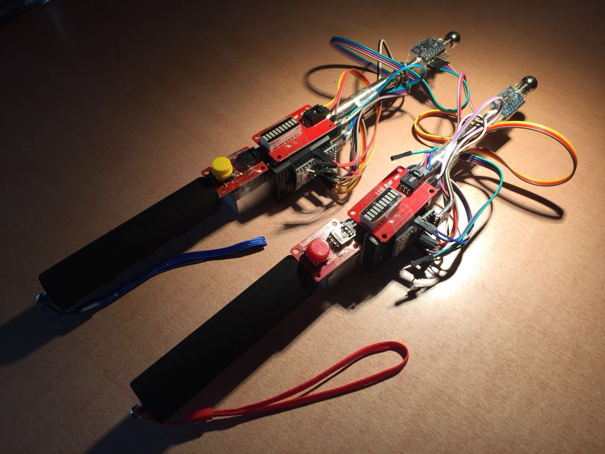

# 魔棒

清华大学美术学院数字媒体艺术双学位 《数字娱乐设计2》2018 课程设计

创作者：王润基，兰星宇，王芷

**"我们重新发明了switch手柄！"**

## 元件

* 伸缩教鞭/导游杆
* Arduino Mini Pro
* MPU6050陀螺仪模块
* HC-05蓝牙模块
* 按钮模块，进度条模块
* 杜邦线若干，面包板一块
* 充电宝

## 程序

* 手柄端：Arduino
* 控制端：Processing
* 控制端通过蓝牙与手柄通信，获取姿态/按键信号，发送指令设置模块状态

## 玩法

手柄只是一个通用交互设备，通过改变控制端的程序可以创造不同的规则。

目前我们主要实现了以下玩法：

* 即时双人对战游戏
* 收集：在以手腕为中心的下半球面上，随机分布若干能量点。手柄上有一个闪烁的小灯，其频率会随着当前最近能量点的距离而变化，越近频率越快，直到常亮时，即可**向前戳一下**收集一点能量。
* 攻击：按住按钮，**在空中画出图案**施法攻击。目前支持alpha/beta/gamma三种字符，分别消耗1/2/3点能量，对对方造成1/2/3点伤害。在对方发招后3s内发出相同招数，会造成双倍伤害。

由于开发时间所限，玩法设定十分粗糙。但这个平台的可挖掘空间还是很大的。